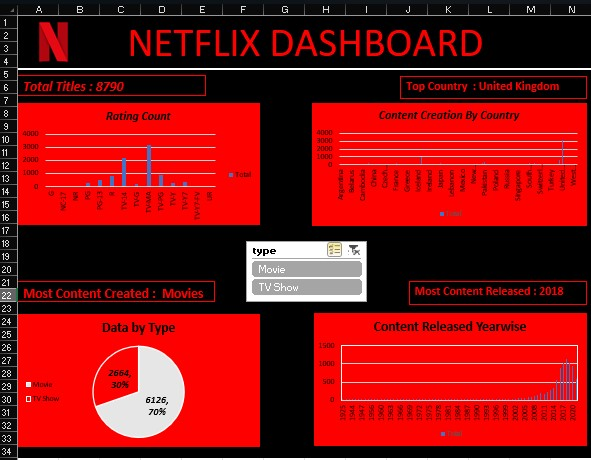

# Netflix Excel Dashboard 📊

An interactive Netflix data analysis dashboard created using Microsoft Excel to explore content types, ratings, countries, and release-year trends.

## 📌 Project Overview

This project analyzes a Netflix titles dataset to identify patterns and trends across movies and TV shows.

The dashboard uses Excel Pivot Tables, Pivot Charts, and Slicers to make the analysis interactive and easy to explore.

## 📊 Dashboard Features

- Total number of Netflix titles
- Movies vs TV Shows distribution
- Titles by rating
- Titles by country
- Year-wise content releases
- Interactive Movie / TV Show filter

## 🛠️ Tools & Techniques Used

- Microsoft Excel
- Pivot Tables
- Pivot Charts
- Slicers
- Data Visualization

## 🔍 Key Insights

- The dataset contains **8,790 Netflix titles**.
- Movies account for approximately **70%** of the titles.
- TV Shows account for approximately **30%** of the titles.
- **United Kingdom** has the highest content count in the analyzed country data.
- **2018** recorded the highest number of content releases in the analyzed data.

## 🎯 Learning Outcomes

Through this project, I practiced:

- Data analysis
- Data visualization
- Excel dashboard creation
- Pivot Tables and Pivot Charts
- Interactive filtering using Slicers
- Presenting data-driven insights

## 📷 Dashboard Preview

## 📁 Project Files

- `netflixexceldashboard.xlsx` — Excel dashboard
- `Netflix_dashboard_preview.png` — Dashboard preview
- `netflix_dashboard_demo.mp4` — Dashboard demonstration

## 👨‍💻 About the Project

Created as part of my **MCA and Data Analytics learning journey**.
